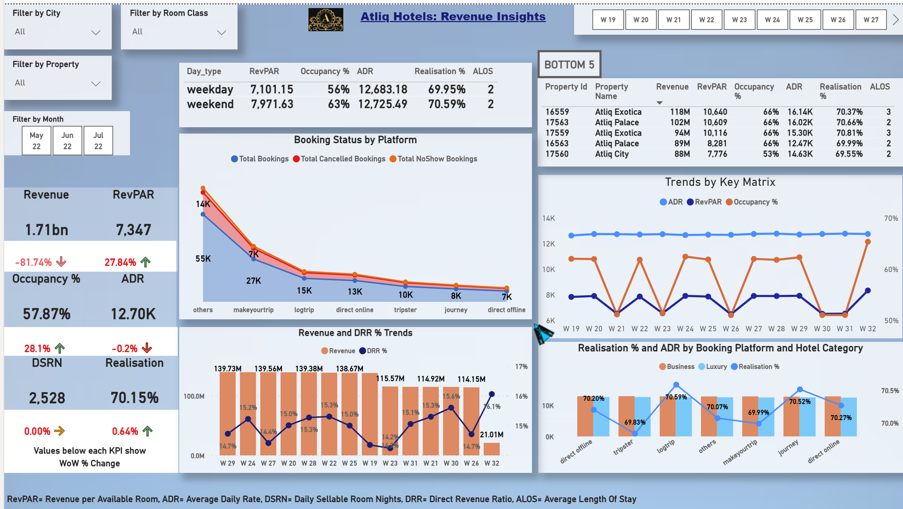

# AtliQ Hospitality Analysis - PowerBI
After completeing Codebasics Power BI module, I have created this dashboard to test my learnings and enhance my  Domain knowledge.

### Problem statement

Atliq Grands owns multiple five-star hotels across India. They have been in the hospitality industry for the past 20 years. Due to strategic moves from other competitors and ineffective decision-making in management, Atliq Grands are losing its market share and revenue in the luxury/business hotels category. As a strategic move, the managing director of Atliq Grands wanted to incorporate “Business and Data Intelligence” in order to regain their market share and revenue. However, they do not have an in-house data analytics team to provide them with these insights.

Their revenue management team had decided to hire a 3rd party service provider to provide them insights from their historical data.

### Task List

You are a data analyst who has been provided with sample data and a mock-up dashboard to work on the following task. You can download all relevant documents from the download section.

- Create the metrics according to the metric list. 
- Create a dashboard according to the mock-up provided by stakeholders.
- Create relevant insights that are not provided in the metric list/mock-up dashboard.

## Mockup dashboard 

## Final dashboard 

##### Learning outcomes from this project:
###### Technical:
<ol>
  <li>Data loading in Power BI</li>
  <li>Data Cleaning in Power Query Editor</li>
  <li>Creating DAX Calculated Columns</li>
  <li>Creating various measures essential for visual creation</li>
  <li>Using Microsoft Power BI effectively to create differnt types of visuals</li>
  <li>How the filters work across different visuals and how to edit interactions with visuals</li>
  <li>Got hands on about how to play with differnt settings in each of the visuals</li>
  <li>Creating Toggle Button betwwen 2 differnt forms of the same visual</li>
</ol>

###### Hospitality Domain Knowledge:
<ol>
  <li>Through sources like Codebasics YouTube channel, prenohq.com, guidingmetrics.com gained knowledge about Hospitality Domain and how Data Analysis is used to boost profits in this domain</li>
  <li>Learned about KPIs like RevPAR, ADR, DRR%, DSRN, Realisation%, ALOS, URN, BRN and how they are studied using data analysis</li>
  <li>Got an understanding of how these KPI insights are used to make informed decisions to improve business</li>
</ol>

###### Insights from the dashboard:
<ol>
  <li>Looking at weekday and weekend comparion for key metrics, the RevPAR and ADR show no major difference. This shows that differential pricing strategy       is not being considered.</li>
  <li> Booking by Platform analysis and DRR % Trend show that direct booking channels of the hotels are attracting comparitively low bookings</li>
  <li>When compared by City, Mumbai is generating the highest revenue whereas Hydrabad is generating the lowest revenue.</li>
  <li>Atliq Exotica is generating the highest revenue whereas Atliq Grand is generating the lowest revenue</li>
  <li>Realisation % for both Tripster and Makeyourtrip Platforms are low compared to others</li>
</ol> 

